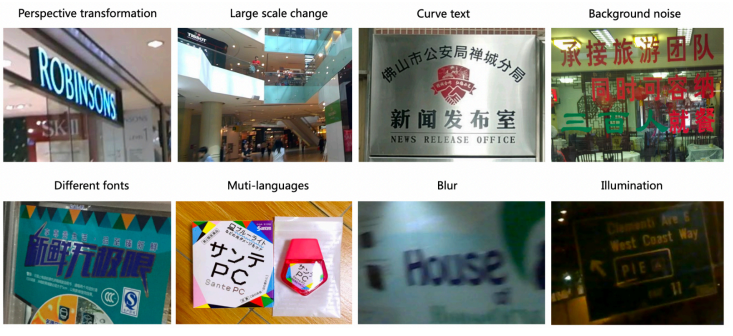
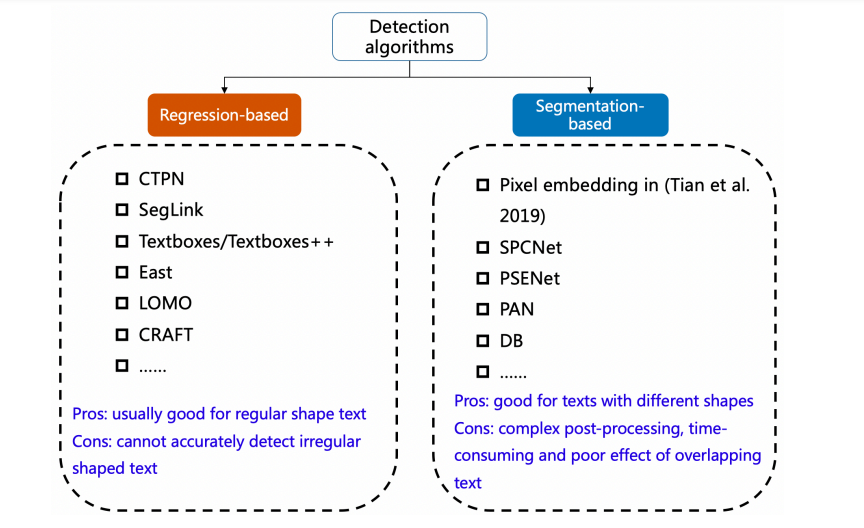
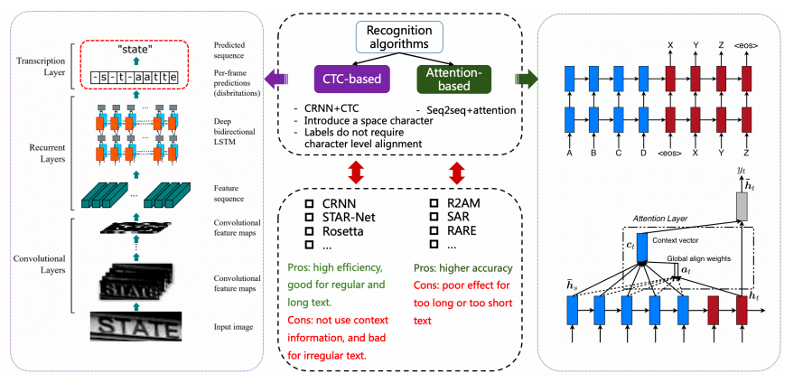
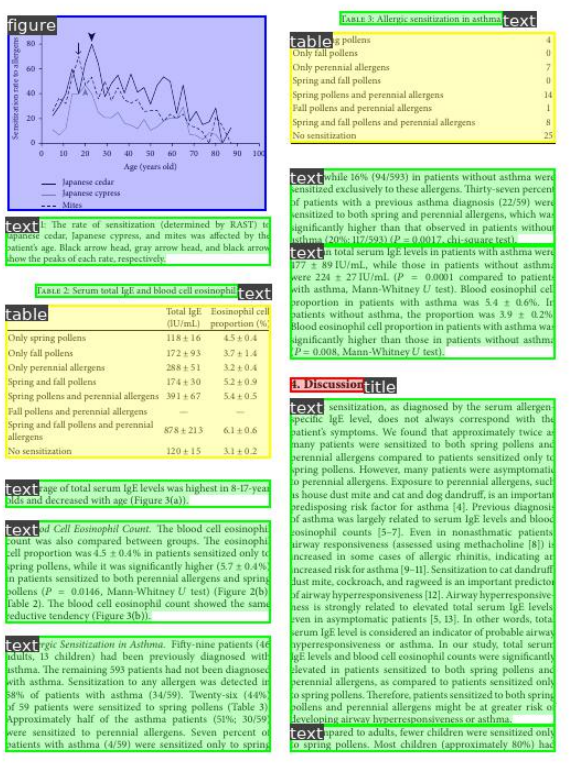
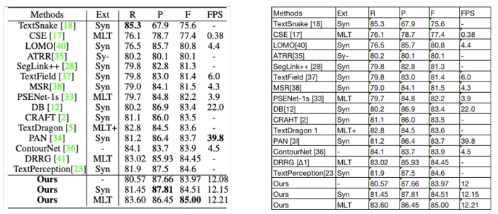
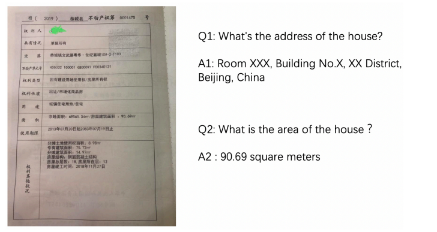

# Dive into OCR

[Book](https://github.com/PaddlePaddle/PaddleOCR/blob/release/2.6/doc/doc_en/ocr_book_en.md)

# 3. Introduction to OCR

## 3.1 Technical Background of OCR

### 3.1.1 Application Scenarios 

- **What is OCR?**
    - Key field in computer vision, refering to scene text recognition, mainly for natural scenes such as signs and other texts in various natural scenes.

- **Applications**
    - Recognition of structured texts of particular areas, such as license plate recognition, bank card information recogniton, ID card information recognition, train ticket information recognition. All of these haved fixed formats in common. Also used in multi-model tasks with other technologies. Eg, in video scenes. 

### 3.1.2 Technical Challenges

- **Algorithmic Challenges**
    - Text Recognition is more difficult in these cases
    

- **Application Challenges**
    - Hard to reach real-time processing
    - OCR application often being deployed in mobile terminals, requires it to be light and fast.

## 3.2 OCR Cutting-edge Algorithms

### 3.2.1 Text Detection

- Locate text regions of the input image
- Is a slight modfication of target detection algorithms.
- Some difference between text and target detection is that texts are often quite long and look like 'stripes', line space is small, texts are curved etc.
- Present text detection algorithms can roughly be divided into two categories: 
    - **Regression-based algorithms**: Some are based on general object detection algorithms, where they realize a detection box using regression by setting up an anchor. Some perform pixel regression directly.
    - **Segmentation-based algorithms**: These type of algorithms perfrom better in detection but since the post-processing is complicated, it might be slow and cannot detect overlapped texts.
    

### 3.2.2 Text Recognition

- Recognize text content in the image.
- Input comes from textual area of the image cut out generated by text detection
- Based on the contour of the text to be recognized, it can be categorized into:
    - **Regular Text Detection**: Mainly printed fonts, scanned texts, which are rought horizontal
    - **Irregular Text Detection**: Not horizontal but curved, covered, blurred. Very challenging.
- Text recognition algorithms can be divided into two types:
    - **CTC-based algorithms**
    - **Seq2Seq-based algorithms**
    

### 3.2.3 Document Stucture Recognition

- Common practical scenarios of OCr are document extraction, contract content comparison, financial factoring document information comparions.
- OCR result + post processing is commonly used but is complicated and cannot be generalized.

**Layout Analysis**

- Classify content of document images into categories like plain texts, titles, tables, pictures etc.
- Current methods generally detect or segment them.

**Table Recognition**

- Identify and transfer table information of document into excel file
- Table are diverse, with various rowspan and colspans and different text types.
- Style of document and light environment during shotting are challenges in table recognition.
 

**Key Information Extraction**

- Important task in document VQA, refering to extraction of needed information from images.
- KIE is divided into two sub-tasks:
    - SER: Semantic entity recognition classifies detected texts into name and ID cards.
    - RE: Relation extraction, classifies detected text, categorizing them into question and answers and finding the corresponding answer for each question,

## 3.3 Industrial Practice of OCR Technology

### 3.3.1 Difficulties in Industrial Practice

- When developing an OCR application, developers often face these three problems:

1. **Hard to find & hard to select**
- Very hard to find suitable code base on the rich open-source community.
- Hard to select and verify algorithms to work on English datasets.

2. **Not applicable to industrial scenarios**
- Open-source community focuses on effect optimization such as reproduction of codes in academic papers and algorithmic effects, instaed of size and speed.
- Because of the scale of data that needs to be processed, GPU becomes too expensive.

3. **Hard to optimize & problematic to train and deploy**
- Open-source algorithms needs to be fine-tuned to fit business needs which takes a lot of resources
- Open-source focuses less on hardware compatibility.

